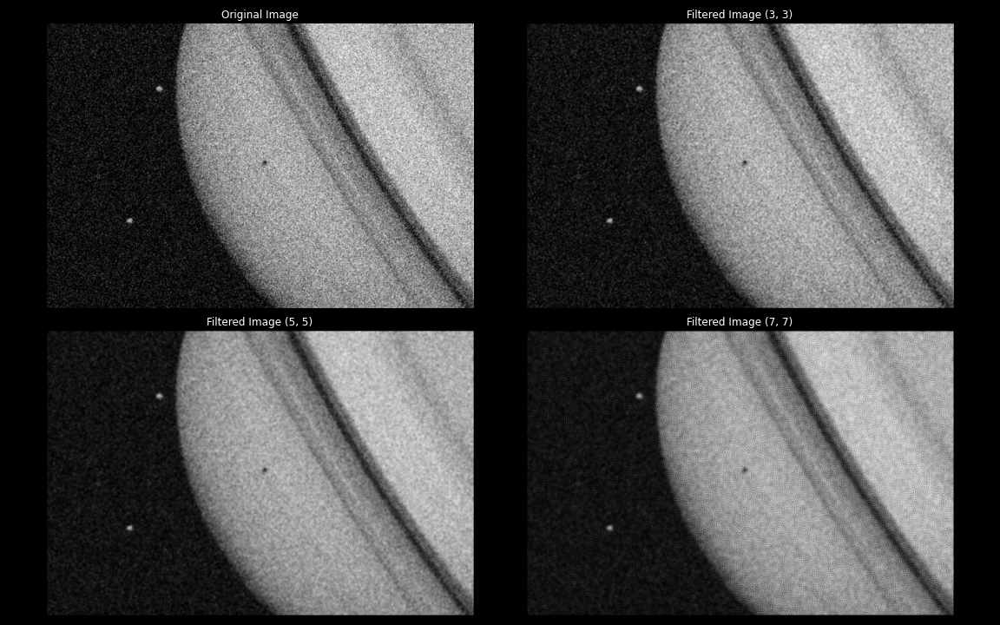

# Wiener-filter

Python Implementation of Wiener's filter for image processing.
Project done by Steve SUISSA and Vicent DEGOT.

How different filters affects an image :

How different kernel sizes affects an image :

Sources :
- https://www.owlnet.rice.edu/~elec539/Projects99/BACH/proj2/blind/bd.html
- https://fr.mathworks.com/help/images/ref/wiener2.html

Based on Image Processing Course Project: Image Filtering with Wiener Filter and Median Filter, Le-Anh Tran
- https://github.com/tranleanh/wiener-median-comparison

Based on SciPy
- https://github.com/scipy/scipy/blob/v1.11.0/scipy/signal/_signaltools.py#L1589-L1661
